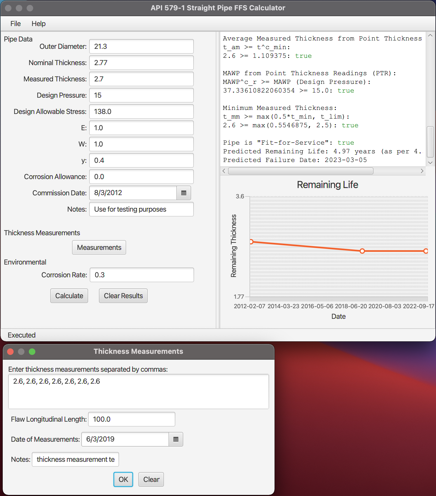

# api-579-calculator
Calculator for various assessments from API 579-1 (2016) Fitness-for-Service

# Requirements
* JDK11 or higher

# Current Features
* Level 1 General Metal Loss FFS Assessment for Type A straight pipes using point thickness measurements

# Potential Future Features
* Elbow pipes
* Thickness profile measurements
* Other components (Shells, heads, etc)
* Level 2 assessments

# Build
Build system utilises gradle, which is nominally run with the IntelliJ IDEA.

# Issues
* See app/src/main/java/module-info.java.bak

# Legal
The software and source code is for educational purposes only and provided "AS IS". In no event will the author(s) be held liable for any damages arising from the use of this software. There is no warranty of any kind, express or implied to the correctness of the source code or software with respect to API 579 or any other standards. Appropriately qualified engineers or personnel (with respect to the jurisdiction) should be conducting any fitness-for-service assessments on coded pressure equipment.